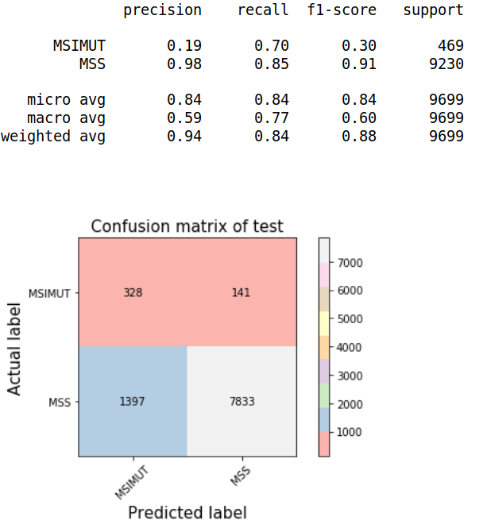

# 基于tqdm动态显示pytorch训练/预测中batch信息的代码演示说明

##  Installation

```pip install -r requirements.txt```


## Run

```
python main.py
```
具体可参看train_demo.ipynb和test_demo.ipynb。主要使用方法如下：
### 训练(from directory)
```python
from __future__ import print_function, division
import torch
import torch.nn as nn
from torchvision import models
from utils import train,test

#假设model_ft是你已经定义好(或已经加载权重)的pytorch模型
data_dir = {'train':'此处为训练集的路径',
                'val':'此处为测试集的路径'}
train_epoch = train.Epoch(
            model_ft,
            data_dir,
            1,#只是普通训练的时候，随便填一个数字也可以
            model_save_path,#这个是保存模型权重文件的路径
            model_base_name,#这个是保存模型权重文件的基本文件名名
            batch_size
            )

    model_wts,train_loss,train_acc,val_loss,val_acc = train_epoch.run()
    # run()的方法默认num_epochs=30,early_patience=5，如果需要改，在创建train.Epoch类时在最后增加这个两个参数定义就可以。
    # 在动态过程中显示的acc是平衡acc，loss是自动根据训练样本的情况对相应类别进行自适应加权
```
显示的效果如下：
Epoch 0/29
----------
train: 100%|██████████| 1165/1165 [1:57:19<00:00,  6.15s/it, CrossEntropyLoss - 0.526, Balanced_acc - 0.8654, recall - 0.7586]  
train Loss: 0.5721 Acc: 0.7202

val: 100%|██████████| 329/329 [23:35<00:00,  3.52s/it, CrossEntropyLoss - 0.4974, Balanced_acc - 0.7943, recall - 0.75]  
val Loss: 0.5262 Acc: 0.7346


### 预测(from directory)
```python
from __future__ import print_function, division
import torch
import torch.nn as nn
from torchvision import models
from utils import train,test

#假设model_ft是你已经定义好(或已经加载权重)的pytorch模型
folder_name = '/cptjack/totem_disk/totem/M_MSI_MSS/normal/test'
test_epoch = test.Test_epoch_from_folder(model_ft,folder_name,batch_size)
result = test_epoch.predict()
# Test_epoch_from_folder最后有两个参数，verbose=True,if_plot = True。前者是是否显示batch的动态acc和loss等信息，后者是是否画混淆矩阵
```
显示的效果如下：
test: 100%|██████████| 19/19 [03:06<00:00,  9.39s/it, CrossEntropyLoss - 0.4899, Balanced_acc - 0.7637, recall - 0.8382]
test Loss: 0.5645 Acc: 0.7758



## 程序目录说明

#### 根目录
主要存放demo代码文件，包括main.py和相应的ipynb文件

#### ./utils/
里面包含两个文件，分别是train和test的封装，需要调整训练默认参数和损失函数的，自行在train里面修改。